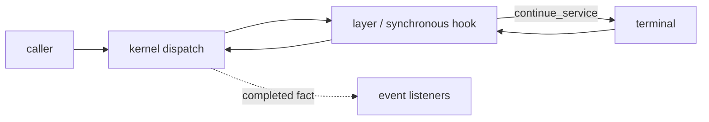

# Kernel hooks

status: partial
coverage:
  - rust/crates/phenix-core/src/runtime/dispatch.rs
  - rust/crates/phenix-core/src/runtime/host.rs
  - rust/crates/phenix-core/src/service_layer_dispatch_regression.rs
  - rust/crates/phenix-core/src/events.rs
  - spec/plugin-events.md
  - spec/plugin-service-layering.md

## Contract

Hook is an authoring term. It does not name a second runtime.

A synchronous hook lowers to a kernel Service Layer. An observational hook lowers to a kernel Event and Listener.



The kernel exposes only its Rust Plugin API. ACP, MCP, Lua, Python, FFI, HTTP, stdio, and other foreign protocols belong to bridge or provider Plugins.

## Ownership

Kernel owns:

```text
RuntimeGeneration
resolved layer ordering
PluginHost
CallScope
authority attenuation
continuation state
cancellation
layer failure/denial semantics
event admission/delivery
trace + provenance
```

Plugins own:

```text
hook handler implementation
domain policy/configuration
handler state
logging/telemetry sinks
foreign protocol/runtime resources
```

A Plugin must not reconstruct or persist kernel call state.

## Synchronous hooks

Use a Layer when behavior may run before an operation, inspect or transform input, deny, delegate once, inspect or transform output, or fail the operation.

```text
pre
-> host.continue_service(...)
-> terminal / remaining layers
-> post
```

Example semantic boundary:

```text
phenix.agent-tool-execution@1
  layer: logging / policy / telemetry
  terminal: tool executor
```

A Layer is the hook handler. The kernel owns ordering and execution.

Do not add a dispatcher service such as `phenix.hooks@1` to the default runtime.

## Observational hooks

Use Events for facts that already occurred.

```text
tool call completed
-> EventBus
-> listeners
```

Listeners cannot veto or roll back the completed operation.

## Identity

Hook points use semantic service or event identity, not implementation functions.

Prefer:

```text
tool.call
model.call
execution.start
execution.finish
context.prepare
```

The concrete lowering may be:

```text
tool.call -> layer on phenix.agent-tool-execution@1
tool.completed -> event contract
```

Avoid identities such as `before_step_runner`, `after_plugin_host`, or `pre_invoke_resolved_chain`.

## Generation lifecycle

Hook topology is resolved with the runtime generation.

```text
configuration
-> resolve RuntimeGeneration G
-> resolve layer/listener topology
-> activate G
-> calls started on G keep G
-> reconcile G+1
-> new calls use G+1
-> in-flight G calls finish on G
```

Invariant:

```text
one causal call tree = one RuntimeGeneration
```

Layer order, listener topology, authority, and policy identity cannot change during that call tree.

## Handler lifecycle

```text
resolve
-> start Plugin
-> Active
-> receive new calls/events
-> stop accepting new work
-> finish or cancel owned work
-> stop Plugin
-> release Plugin-owned resources
```

Current core has `Registered | Active | Stopped`. An explicit `Draining` state is a follow-up. Until then, stop/reconciliation must preserve the same rule: retired handlers receive no new work.

`PluginHost` is kernel-owned and invocation-scoped. Plugins must not retain it after the invocation returns.

Foreign resources remain owned by the Plugin that created them:

```text
ACP transport -> ACP bridge Plugin
Lua VM        -> Lua bridge Plugin
HTTP client   -> provider Plugin
FFI handle    -> ABI bridge Plugin
```

## Legacy dispatcher

`phenix-plugin-hooks` is compatibility code. It is not part of the default suite.

Migration:

```text
synchronous HookAction
-> semantic Service Layer

completed-fact observation
-> Event + Listener

hook configuration
-> configuration of the handler Plugin
```

Delete the legacy dispatcher after all users lower to Layers or Events.

## Invariants

- Kernel owns hook execution mechanics.
- Plugins own hook behavior.
- No hook-specific scheduler or dispatcher runtime.
- Synchronous interception uses Layers and one-shot continuations.
- Completed facts use Events.
- Hook topology is generation-pinned.
- Authority never expands through a hook.
- Foreign protocols stay behind Rust Plugins.
