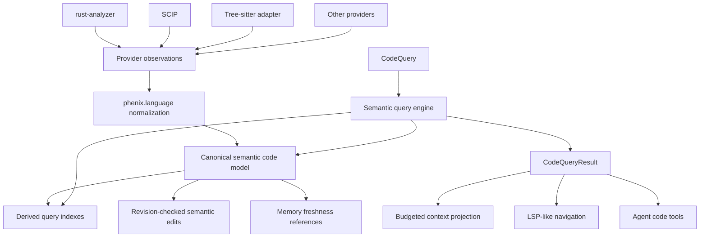

# Unified semantic code query

status: partial

## Goal

Expose one provider-neutral semantic code interface for point queries, structured reads and edits, and repository-scale graph traversal.

The interface must keep one canonical code model. A repository graph is a rebuildable query index over canonical code facts. It is not another semantic store.

The same logical entity, revision, relation, lineage, source evidence, and provenance must serve:

- LSP-like position and entity queries;
- repository structure queries;
- bounded multi-hop relation traversal;
- token-budgeted context projection;
- semantic edits;
- memory freshness checks.

## Current foundation

`phenix.language@1` already owns the canonical semantic code facts:

- `LogicalCodeEntity`;
- `CodeEntityRevision`;
- `CodeEntityFacetRevisions`;
- `CodeEntityRelationKind` and `CodeEntityRelations`;
- `CodeEntityLineage`;
- `CodeEntitySourceLocator`;
- provider observations and epochs;
- entity change events;
- revision-checked structured reads and edits.

The gap is the query shape. `LanguageCommand` exposes many operation-specific reads. Adding a separate repository-graph service would create a second query model and pressure the implementation toward duplicate semantic state.

## Invariant

`LogicalCodeEntity` and its revisioned facets and relations are the single source of truth for semantic code identity.

Provider outputs are evidence. Query indexes are derived state.

Deleting an index may make queries slower or temporarily unavailable. It must not change semantic identity or meaning.

## Architecture



## Extraction level

Provider operations and public code queries are separate levels.

Provider operations answer how evidence is acquired:

- definition;
- references;
- implementations;
- document symbols;
- workspace symbols;
- call hierarchy;
- diagnostics.

Public queries answer what semantic information the caller needs.

A provider-specific operation may normalize into one or more canonical entities, facets, or relations. Consumers must not depend on the provider operation that produced them.

For example:

```text
LSP incomingCalls
    -> provider observation
    -> normalize to Calls relation
    -> CodeQuery relation traversal with direction = incoming
```

## Unified query

The target public read shape is:

```rust
struct CodeQuery {
    anchor: CodeAnchor,
    selection: CodeSelection,
    traversal: Option<CodeTraversal>,
    projection: CodeProjection,
    budget: CodeBudget,
}
```

### Anchor

An anchor selects where extraction begins.

```rust
enum CodeAnchor {
    Position {
        document: LanguageDocumentIdentity,
        position: CodeSourcePosition,
    },
    Entity {
        entity: LogicalCodeEntity,
        revision: Option<String>,
    },
    Document {
        document: LanguageDocumentIdentity,
    },
    Repository {
        repository_id: String,
    },
}
```

The first implementation may support entity and repository anchors before position resolution moves behind the same command. Unsupported anchor/selection combinations must fail explicitly.

### Selection

Selection describes the requested semantic information.

Initial selections:

- entity metadata;
- source locator;
- source/body;
- facets;
- semantic relations;
- changed neighborhood;
- repository structure.

Existing operation-specific commands remain compatibility adapters during migration. They should delegate to the same implementation where practical.

### Relations

Canonical relations should describe semantics, not LSP request names.

The target relation vocabulary separates edge meaning from traversal direction:

```rust
enum CodeRelationKind {
    Calls,
    References,
    Implements,
    Contains,
}

enum CodeRelationDirection {
    Outgoing,
    Incoming,
    Both,
}
```

Existing `Callers`, `References`, and `Implementations` storage must migrate without creating a second truth. Compatibility mapping may remain while provider ingestion is normalized.

`Calls + Incoming` corresponds to callers.
`Calls + Outgoing` corresponds to callees.

Reverse indexes are derived from canonical directed edges. Do not persist two independently authoritative directions.

### Traversal

Traversal turns the same semantic query into a repository graph query.

```rust
struct CodeTraversal {
    relations: Vec<CodeRelationKind>,
    direction: CodeRelationDirection,
    max_depth: u32,
}
```

A point query normally has no traversal or depth one.

A repository graph query uses the same anchor and selection with bounded traversal.

All traversal must also obey hard node, relation, and byte budgets.

### Projection

Projection controls how much evidence enters the result:

```rust
enum CodeProjection {
    Identity,
    Structural,
    Signatures,
    SourceLocations,
    Source,
}
```

Graph/context queries should normally use `Structural`.

Exact source is a later expansion of selected entities, not an automatic consequence of graph traversal.

### Budget

Every query whose result can scale with repository size is bounded.

```rust
struct CodeBudget {
    max_entities: u32,
    max_relations: u32,
    max_bytes: u64,
}
```

Results must report truncation and coverage explicitly.

## Result model

Use one query result shape instead of separate LSP and graph results.

A result should carry:

- root anchors;
- repository identity;
- entity revisions;
- selected projected entity metadata;
- directed relations;
- coverage and completeness;
- truncation;
- continuation where useful;
- provenance sufficient to validate the facts.

Small point queries may contain one entity and one relation. Repository traversal may contain hundreds. Consumers use the same contract.

## Repository graph

The repository graph is an execution strategy behind `CodeQuery`.

It may maintain rebuildable indexes for:

- entity identity;
- repository membership;
- document containment;
- outgoing relations;
- incoming relations;
- changed entities;
- relation revision.

The index must never become the canonical owner of entities or relations.

The first implementation should use the simplest deterministic index that prevents full relation scans for normal traversal. Do not add an external graph database.

## Revision semantics

A query must not silently combine incompatible revisions.

The query engine must preserve the current guarantees around:

- provider epoch;
- entity revision;
- source revision;
- relation completeness;
- stale observation rejection.

Repository-wide traversal needs one explicit consistency rule. Prefer a repository/query revision or sequence derived from the existing entity change sequence if it can represent the required snapshot. If it cannot, document the gap before inventing another revision model.

## Context integration

Context should consume `CodeQuery`, not a graph-specific service.

The intended token-efficient path is:

```text
task evidence
    -> seed position/entity/document/repository
    -> CodeQuery structural traversal
    -> deterministic ranking and budget reduction
    -> compact context resource
    -> exact entity source only when needed
```

Do not inject a whole repository graph into every model turn.

## Memory integration

Memory references canonical entity/facet/relation revisions.

Memory must not own or copy the repository graph.

Graph indexes may help find related memory evidence, but freshness remains tied to canonical semantic revisions.

## Mutations

Reads and graph traversal unify under `CodeQuery`.

Writes remain a distinct request family because their semantics require exact source preconditions, validation evidence, and workspace transaction receipts.

The high-level interface may eventually be:

```rust
enum CodeCommand {
    Query(CodeQuery),
    Mutate(CodeMutation),
}
```

Do not model an edit as graph traversal.

## Migration

Implement this incrementally.

1. Add provider-neutral `CodeQuery` types beside the existing language commands.
2. Route existing entity/relation reads through shared query helpers.
3. Add bounded entity/repository traversal over canonical relation facts.
4. Normalize relation semantics and derive incoming indexes from directed edges.
5. Add document/position anchors through the same query API.
6. Move context expansion to `CodeQuery`.
7. Deprecate redundant operation-specific public reads only after all consumers migrate.

Compatibility adapters are acceptable. Duplicate semantic persistence is not.

## First implementation slice

This PR should establish:

- the `CodeQuery` contract;
- entity and repository anchors;
- structural relation selection;
- bounded deterministic traversal;
- explicit coverage/truncation;
- derived incoming/outgoing indexes or equivalent bounded lookup;
- compatibility with existing `LogicalCodeEntity` and relation persistence;
- regression tests proving existing point reads and new graph reads observe the same facts.

Position-driven provider resolution, richer containment extraction, ranking, and context projection may follow in later commits on the same PR if they remain coherent.

## Acceptance

Before merge, verify:

- one canonical logical entity identity exists;
- one canonical relation fact produces both point and graph answers;
- graph indexes are rebuildable;
- no graph-specific semantic store exists;
- provider replacement does not change the query contract;
- traversal cannot grow without explicit bounds;
- traversal order is deterministic;
- incomplete provider relation sets remain marked incomplete;
- stale relation facts cannot enter a current result;
- structural projection does not read source bodies;
- existing semantic edits retain their revision guarantees;
- existing callers/references/implementations behavior can be represented through the unified query;
- repository traversal and point reads agree on entity/relation revisions.

## Non-goals

This design does not require:

- learned graph ranking;
- embeddings;
- Joern;
- an external graph database;
- whole-repository source projection;
- replacing LSP/SCIP provider adapters;
- moving code semantics into Core.
